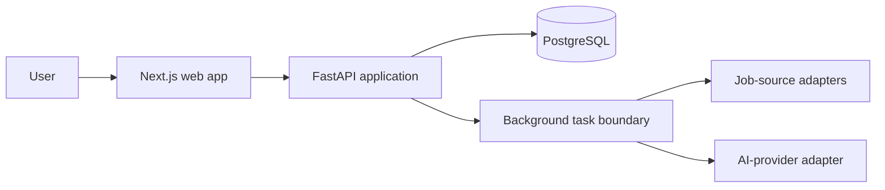

# Architecture overview

## Scope

The initial system is a modular monolith with two runtime applications: a browser-based web client and a Python API. PostgreSQL is the system of record. Collection workers and AI enrichment belong to the backend codebase and can run as separate processes later without becoming separate services.

The task boundary is architectural, not deployed infrastructure in phase one.

## Domain boundaries

- **jobs** owns normalized job postings, source references, role category, location, language requirements, and lifecycle.
- **companies** owns employer identity and company-level facts.
- **applications** owns a user's application pipeline and status history.
- **profiles** owns candidate preferences, skills, and constraints.
- **recommendations** owns match results and their human-readable evidence; it does not own jobs or profiles.

Each domain will later contain its own models, services, and repository interfaces. Empty directories currently document intended ownership without pretending those abstractions have already been designed.

## Data flow, later

1. A source adapter obtains a posting in accordance with that source's terms and access rules.
2. The backend retains provenance and raw source data.
3. Deterministic normalization maps it into the common job schema.
4. Optional AI enrichment extracts ambiguous attributes or drafts explanations.
5. Recommendation logic combines explicit filters with scored, explainable evidence.
6. The API exposes results to the web client.

## Important deferred decisions

- Which job sources are legally and technically appropriate.
- The first AI use case and model provider.
- Whether semantic search is valuable enough to enable `pgvector`.
- Whether task volume warrants Redis and Celery.
- Authentication and hosting provider.

Deferring these avoids locking the project to technology before requirements and evidence exist.
